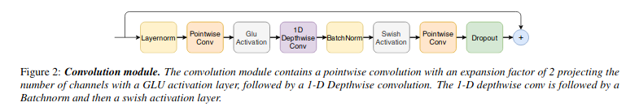

</img>

## Conformer

Implementation of the convolutional module from the <a href="https://arxiv.org/abs/2005.08100">Conformer</a> paper, for improving the local inductive bias in Transformers.

## Install

```bash
$ pip install conformer
```

## Usage

```python
import torch
from conformer import ConformerConvModule

layer = ConformerConvModule(
    dim = 512,
    causal = False,             # auto-regressive or not - 1d conv will be made causal with padding if so
    expansion_factor = 2,       # what multiple of the dimension to expand for the depthwise convolution
    kernel_size = 31,           # kernel size, 17 - 31 was said to be optimal
    dropout = 0.                # dropout at the very end
)

x = torch.randn(1, 1024, 512)
x = layer(x) + x
```

## Citations

```bibtex
@misc{gulati2020conformer,
    title={Conformer: Convolution-augmented Transformer for Speech Recognition},
    author={Anmol Gulati and James Qin and Chung-Cheng Chiu and Niki Parmar and Yu Zhang and Jiahui Yu and Wei Han and Shibo Wang and Zhengdong Zhang and Yonghui Wu and Ruoming Pang},
    year={2020},
    eprint={2005.08100},
    archivePrefix={arXiv},
    primaryClass={eess.AS}
}
```
